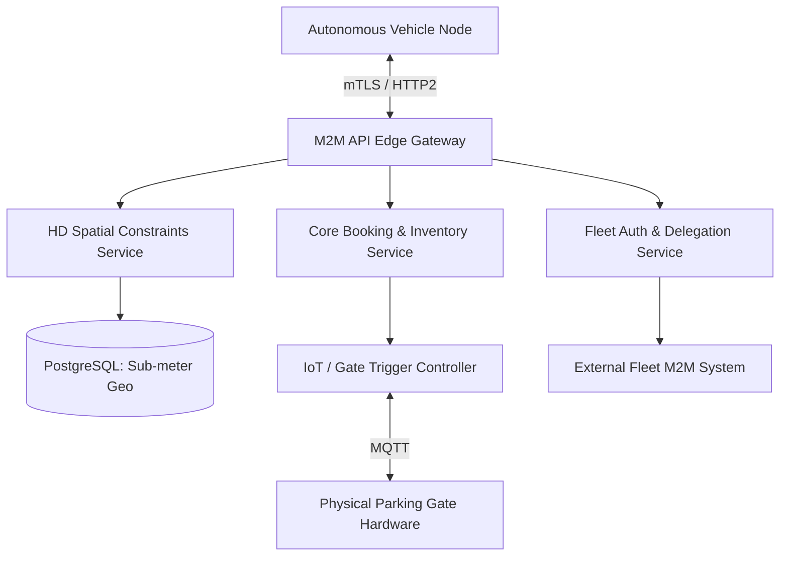
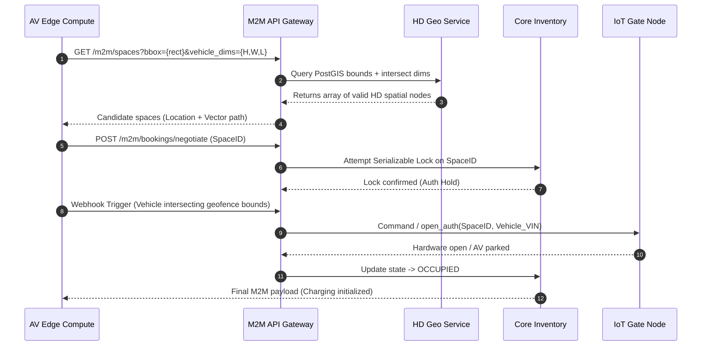

# Sprint 8.1 Autonomous Vehicle Integration

# Parking Nomads: M2M Autonomous Vehicle Integration Platform

## 1. Title
Parking Nomads: M2M Autonomous Vehicle Booking & Routing Integration Subsystem
**Document Version:** 1.0 (Sprint 8.1 Roadmap Draft)
**Scope:** Machine-to-Machine (M2M) API Gateway, Hardware Integration, Autonomous Navigation Routing Data

## 2. Overview
The M2M Autonomous Vehicle (AV) Integration Subsystem is a programmatic extension of the core Parking Nomads orchestration platform. It replaces human-in-the-loop mobile application workflows with high-frequency, headless spatial negotiation designed for Level 4/5 autonomous vehicles. 

Its business purpose is to capture commercial fleet operations (robotaxis, autonomous delivery logistics) by enabling vehicles to discover, navigate to, negotiate constraints for, and securely access parking spaces without human intervention. Technically, this requires exposing a low-latency gRPC/HTTP API plane that supplies hyper-precise HD mapping attributes, handles V2X (Vehicle-to-Everything) IoT hardware triggers, and utilizes a delegated authorization protocol for programmatic financial settlement.

## 3. Architecture
The AV Integration subsystem bypasses the standard API Gateway to utilize a dedicated edge-terminated M2M ingestion plane optimized for mutual TLS (mTLS) and bi-directional persistent connections required for active autonomous traversal states.



### Key Components and Interactions
*   **M2M API Edge Gateway:** Provides low-latency SSL termination specifically for non-human programmatic actors, enforcing stringent rate limits per vehicle.
*   **Fleet Auth & Delegation Service:** Maps distinct vehicle instances back to a master fleet wallet/account via Client Credentials grants.
*   **HD Spatial Constraints Service:** Serves sub-meter topological data (curb heights, turn radius, gradient) necessary for AV navigation planning, overriding standard human-readable descriptions.
*   **IoT Trigger Controller:** An internal MQTT broker and state-machine controlling edge hardware (boom gates, bollards) executing state changes only when an authenticated AV geofence intersection is verified.

## 4. Data Flow / Process Flow
This outlines the core transactional loop: discovery, deterministic negotiation, lock, and physical IoT ingestion.



## 5. Components / Modules

### 5.1 HD Spatial Constraints Service
*   **Responsibility:** Evaluates rigid spatial polygons against vehicle physical dimensional constraints to prevent mathematically impossible path planning.
*   **Inputs:** Bounding Box (Polygon), Vehicle Kinematic Constraints (Height, Width, Length, Min Turn Radius).
*   **Outputs:** GeoJSON-compliant feature collections featuring sub-meter entry vectors.
*   **Dependencies:** Read-replica synchronization from PostgreSQL/PostGIS.
*   **Failure Modes:** Drift between database constraints and physical reality (e.g., debris obstructing space). Requires vehicle local computer vision fail-over handling and programmatic `NACK` (Negative Acknowledge) API loops.

### 5.2 IoT Trigger Controller
*   **Responsibility:** Translates logical backend reservation states into physical local network triggers (opening hardware gates or disengaging bollards) at the exact millisecond of AV proximity.
*   **Inputs:** Valid `booking_id`, IoT Edge Identifier, Hardware Action Code.
*   **Outputs:** Physical state change, State verification loop completion.
*   **Dependencies:** Cloud-to-device network tunnels, remote hardware operability.
*   **Failure Modes:** MQTT timeout/lost ACK from the hardware gate. Triggers localized Bluetooth Low Energy (BLE) direct vehicle-to-gate fallback mechanism.

## 6. Data Model
Sprint 8.1 relies on non-destructive additions to the existing inventory schema via explicit one-to-one metadata entities.

### New & Modified Tables

*   **`fleet_vehicle_agents`**
    *   **Grain:** One row per registered physical vehicle under an autonomous operations account.
    *   **Fields:** `agent_id` (UUID), `fleet_account_id` (UUID, FK), `vin` (String), `dimensions_json` (JSONB), `cert_fingerprint` (String, for mTLS validation).
*   **`space_hd_topology`**
    *   **Grain:** One row extending exactly one `parking_spaces` base record with dimensional complexity parameters.
    *   **Fields:** `space_id` (UUID, FK/PK), `entry_vector_line` (PostGIS LineString), `max_height_mm` (Integer), `max_width_mm` (Integer), `max_weight_kg` (Integer), `is_iot_equipped` (Boolean).
*   **`reservations` (Migration Delta)**
    *   Added Enum state: `HARDWARE_FAULT` (Invoked when logical booking exists but IoT hardware blocks physical entry).

## 7. APIs / Interfaces

### POST /m2m/v1/spaces/negotiate
Atomically validates spatial constraints against the vehicle, generates a lock, and sets the proximity geofence listener parameters.

*   **Method:** POST
*   **Headers:** `Content-Type: application/json`, `X-Vehicle-Cert: <mTLS SHA256 Fingerprint>`
*   **Request Structure:**
    ```json
    {
      "space_id": "uuid",
      "agent_id": "uuid",
      "projected_arrival_ms": 1718049600000,
      "kinematic_profile_override": {
        "is_trailer_attached": false
      }
    }
    ```
*   **Response Structure (201 Created):**
    ```json
    {
      "negotiation_id": "uuid",
      "iot_edge_token": "jwt",
      "iot_ble_fallback_mac": "00:1B:44:11:3A:B7",
      "allocated_entry_vector": "[ [Lat,Lng], [Lat,Lng] ]"
    }
    ```
*   **Error Handling:**
    *   `406 Not Acceptable`: Vehicle kinematic profile cannot mathematically navigate the `entry_vector_line`.
    *   `423 Locked`: Pre-negotiated spatial reservation timeout block.

## 8. Business Logic
*   **Hard Dimension Rejection:** Any AV query providing physical dimensions strictly exceeding standard bounding box topologies returned from PostGIS are summarily rejected at the edge. The AV M2M platform relies exclusively on absolute limits; no "probabilistic" fitting is tolerated.
*   **Programmatic Re-route Tolerance:** If an AV arrives at a booked spatial polygon, uses local LiDAR/Camera stacks to determine physical blockage, and issues a `DELETE /m2m/v1/spaces/negotiate/{id}` with reason `PHYSICAL_OBSTRUCTION`, the system executes an automatic 100% refund, cancels the block, and invokes a critical backend verification task to mark the `parking_spaces` as inactive.

## 9. Deployment / Execution
*   **Network Boundary Location:** M2M gateways execute decoupled from main User Traffic API Gateway boundaries. Deployed targeting AWS API Gateway instances possessing direct integrations into private API endpoints enabling edge mTLS certificate authorities to negotiate exclusively isolated from HTTP traffic rulesets. 
*   **Scale Topology:** IoT controllers mandate multi-availability zone deployments per region to prevent widespread gate-opening paralysis due to localized control-plane drops.

## 10. Observability
*   **State Machine Transition Telemetry:** Crucial requirement to trace M2M payload processing via structured spans tracking exact duration from 'Vector Routing Generated' -> 'Intersection Proximity Achieved' -> 'IoT State Shifted'. 
*   **Physical Divergence Anomalies:** Key Alert metric defined counting high-frequency "Aborts" where AV nodes abandon logic locks due to computer vision detecting conflicting hardware states at coordinates. Rapid clustering designates high severity local geographic node issues.

## 11. Failure Handling & Recovery
*   **IoT Synchronization Loss:** If `space_hd_topology.is_iot_equipped` equals `TRUE` but the edge MQTT node disconnects mid-negotiation, the subsystem blocks any pending `negotiate` calls until healthcheck restored and propagates a `503 Service Unavailable` explicit back to the vehicle triggering its own independent fall-back parking re-routing parameters instantly. 
*   **Zombie Vehicle Holds:** M2M network sessions contain rigid active keep-alive websockets tracking AV movement velocity vector estimations vs arrival time estimates. If the vector ceases correlating to projected arrival bounding by >15 minutes sans manual traffic notification payload receipt, system drops transaction as ghost hold safely resolving capacity locks automatically.

## 12. Assumptions & Constraints
*   **Explicit M2M Requirement:** It is strictly assumed vehicles connecting adhere comprehensively to predefined schema boundaries. Platform assumes total external control software architecture compliance matching strictly provided API structural formats devoid of backwards capability allowances for malformed legacy agent definitions.
*   **Fleet Billing Only:** Single independent consumer vehicles lacking predefined enterprise tenant API secret mapping keys utilizing standard individual User schemas are not authorized context execution within M2M API clusters.
*   **Network Subterranean Degradation Limitations:** Deep multi-level concrete basements disrupt cellular M2M tracking capabilities causing standard tracking loop failures; system architecture explicitly constrains support parameters strictly supporting L1 ground level mapping topology validation lacking specialized dead-reckoning hardware deployment frameworks currently.

## 13. Security & Access Control
*   **Cryptographic Agent Identification:** Requires explicit validation of hardware encoded x.509 client certificates provisioned solely via established B2B out-of-band certificate authorities mapped via mutual verification protocols across TLS version 1.3 only. Passwords and Basic Auth constructs are explicitly denied structural implementation boundaries.
*   **Agent Constraint Scopes:** Machine token claims strictly evaluate down limiting manipulation bounding boxes isolating fleet entity operations tightly strictly forbidding execution data querying capabilities spanning globally. Authorized only generating reads correlated within exactly local proximity constraints per invocation parameter dynamically updating.

## 14. Scalability Considerations
*   **Polling Overhead Thrashing:** Shifting continuous location transmission mapping operations over from standardized sequential polling techniques directly transitioning strictly over onto persistent localized gRPC streams drastically minimizes protocol level transport drag per message transmitted conserving backend processing allocations.
*   **Database Geospatial Processing Threshold Limits:** Executing deep intersecting vector operations continuously during navigation phases produces aggressive lock up capabilities mapping standard indexing topologies resulting inherently forcing regionalized read shard distribution segregations strictly containing computational load spikes effectively limiting radius damage scopes comprehensively across system processing profiles.

## 15. Future Enhancements
*   **Dynamic Variable Space Adjustment Pipelines:** Integrating fluid allocation polygons capable recalculating exact spatial lines collapsing larger multi-parking block grids dynamically distributing slots relative accommodating irregular size variances fluidly increasing total landmass maximization density logic configurations organically matching actual vehicular ingress requirements exactly lacking static delineations globally defining parameters.
*   **V2G Integration Pathing Contextually Tracking Capacity Flow Mapping Integrations:** Coupling battery electric states with specialized smart induction grids dynamically weighting space selections automatically biasing vehicles matching specified SoC metrics automatically directing onto inductive hardware equipped blocks negotiating simultaneous power transfer cost parameters wrapped structurally under generalized negotiation endpoints natively simultaneously routing parking capability mappings logically matching grid capacity capabilities intelligently seamlessly mapping capabilities locally integrating fully simultaneously updating logical parameters cleanly seamlessly processing accurately.
