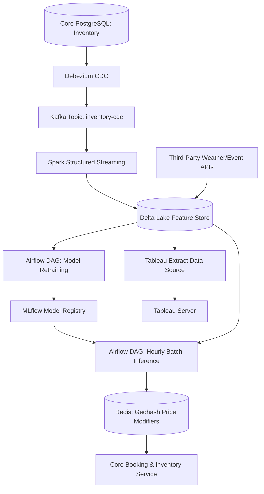
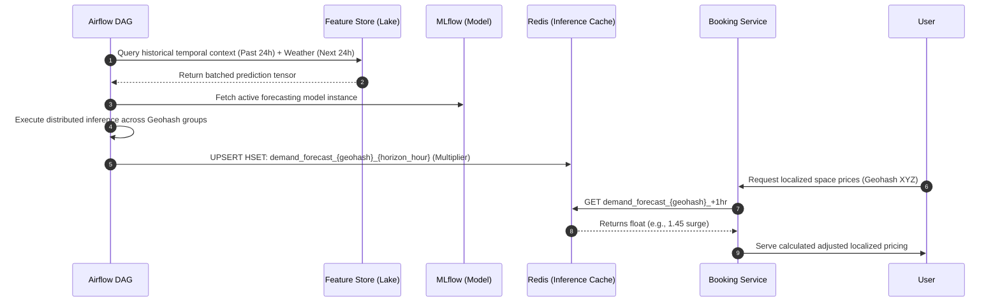

# Sprint 8.2 Demand Forecasting Expansion

# Parking Nomads: Machine Learning & Predictive Demand Forecasting Expansion

## 1. Title
Parking Nomads: Spatio-Temporal Demand Forecasting and Dynamic Pricing Expansion
**Document Version:** 1.0 (Sprint 8.2 Roadmap Architecture)
**Scope:** Machine Learning Pipeline, Distributed Feature Store, Real-Time Inference Cache, Tableau Analytics 

## 2. Overview
The Demand Forecasting Expansion is a predictive analytics and machine learning (ML) pipeline designed to preemptively adjust parking inventory pricing and availability limits before demand materializes. 

Its business purpose is to maximize yield for hosts and guarantee liquidity for users during localized high-stress events (e.g., concerts, severe weather, regional road closures). Technically, the system transitions the core pricing logic from reactive (capacity thresholds breached in real-time) to proactive. It ingests historical transactional telemetry and third-party context (weather APIs, traffic vectors) to generate N-hour horizon utilization forecasts per geohash. These forecasts are exposed to operational teams via Tableau and to the core API Gateway via a microsecond-latency Redis inference cache for automated pricing adjustments.

## 3. Architecture
The forecasting subsystem acts as an asynchronous sidecar to the Core Booking orchestrator. It uses Change Data Capture (CDC) to stream data into a data lake without affecting OLTP write performance, followed by scheduled Airflow batch processing for model generation and inference.



### Key Components and Interactions
*   **Delta Lake Feature Store:** The centralized analytical datastore. Flattens JSON spatial features and transactional history into columnar parquets partitioned by timestamp and geohash.
*   **Airflow Model Orchestrator:** Manages the dependency chain between feature materialization, model validation, and localized price multiplier caching.
*   **MLflow Registry:** Handles version control for predictive models (XGBoost instances), supporting A/B testing on staging configurations.
*   **Tableau Operational BI:** Read-only analytical plane providing System Administrators with temporal forecast overlays to manual surge price override switches.

## 4. Data Flow / Process Flow
This delineates the scheduled inference generation cycle mapped to front-end utilization.



## 5. Components / Modules

### 5.1 Real-Time Pricing Inference API
*   **Responsibility:** Intercepts synchronous inventory pricing fetches from the Booking Service, querying the forecast cache, and injecting predictive surges.
*   **Inputs:** Internal Lat/Long context, UTC Timestamp.
*   **Outputs:** Localized surge modifier float (e.g., `1.30`).
*   **Dependencies:** Redis (primary datastore).
*   **Failure Modes:** Cache-miss or Redis connection drop. Defaults immediately to base `1.0` modifier, allowing system to fallback to Sprint 9.1 reactive pricing rules to ensure transactional availability.

### 5.2 External Context Ingestion Service
*   **Responsibility:** Polling external un-managed datasets (city council roadwork APIs, severe weather warnings).
*   **Inputs:** Geofence Bounding Boxes, Scheduled execution crons.
*   **Outputs:** Cleaned parquet partitions populated into the Delta Lake.
*   **Dependencies:** Third-party REST interfaces, API limits.
*   **Failure Modes:** Rate limiting or changing schema definitions on third-party sources. Triggers alerting but model executes with degraded baseline features via imputation (filling nulls).

## 6. Data Model
To minimize transactional impact, forecasting structures execute entirely within columnar representations independent from normalized PostGIS configurations.

### `feature_geohash_hourly` Table (Delta Lake Grain)
*   **Grain:** Aggregate one row per Geohash Level 6 cell, per hour UTC.
*   **Key Fields:** 
    *   `geo_id` (String - Geohash-6), `hour_index` (Timestamp)
    *   `historical_occupancy_ratio` (Decimal - target feature)
    *   `weather_precipitation_mm` (Float - environmental factor)
    *   `nearby_active_event_count` (Integer)

### `redis_surge_modifiers` Hash Mapping (Redis Cache)
*   **Grain:** Per geohash, forward projected temporal hours.
*   **Key/Value Design:** 
    *   Key: `surge:geo6:<geohash>:<epoch_hour>`
    *   Value: `1.50` (Price multiplier calculated via utilization probability > 90%)

## 7. APIs / Interfaces

### GET /api/internal/pricing/surge-multiplier
Internal VPC endpoint exclusively accessible by the Core Inventory service during pricing negotiation mapping.

*   **Method:** GET
*   **Query Parameters:** `geohash=u4pruj`, `target_timestamp=1718049600000`
*   **Response Structure (200 OK):**
    ```json
    {
      "geohash": "u4pruj",
      "applied_multiplier": 1.25,
      "forecast_occupancy_pct": 0.88,
      "prediction_confidence": 0.91
    }
    ```
*   **Error Handling:**
    *   `404 Not Found`: No predicted tensor mapped. Service operates on base pricing natively handling degradation seamlessly.

## 8. Business Logic & Tableau Engineering Architecture

### 8.1 Core ML Transformation Rules
*   **Time Window Decay:** The forecasting system applies exponentially weighted moving averages against historical data. Utilization rates from exactly one year prior (YoY pattern matching) carry heavy model weight relative to yesterday's rate unless current hour standard deviations strictly eclipse bounds.
*   **Zero-Inventory Nullification:** Multipliers cap fundamentally at a maximum output matrix of `2.0x`. A physical block demonstrating total capacity (100% reservation) retains this maximum multiplier for localized queued waitlist options. 

### 8.2 Tableau Analytics Implementation Architecture
To provide platform administrators visualization capabilities monitoring the demand logic, a direct extraction connects to the Delta Lake. The following standards govern the development of the *Demand & Prediction Drift Dashboard*.

*   **Calculated Fields:**
    *   `cf_occupancy_variance_pct`: Determines deviation of machine model accuracy.
        *   `Definition`: `(SUM([Actual_Occupancy_Count]) - SUM([Predicted_Occupancy_Count])) / SUM([Available_Inventory])`
    *   `cf_foregone_yield`: Measures monetary loss against inaccurate non-surged forecasting events.
        *   `Definition`: `IF [cf_occupancy_variance_pct] > 0 THEN (SUM([Actual_Occupancy_Count]) * AVG([Base_Price])) * (1.25) - SUM([Actual_Revenue]) END`

*   **Dashboard Parameters:**
    *   `p_prediction_horizon`: Integer List (1, 6, 12, 24). Defines the X-Axis forecast bounds mapped dynamically switching measures calculating predicted yield charts dynamically. 
    *   `p_surge_trigger_threshold`: Float (Default `0.85`). Dynamically adjusting heat map colors, highlighting geographic zip areas matching required human-driven overriding capabilities relative expected usage rates.

## 9. Deployment / Execution
*   **Training Compute Context:** Deployed utilizing Apache Spark multi-node clusters processing historical partitions overnight at 02:00 UTC strictly segregated away from read execution namespaces preventing analytical queries bleeding I/O away from production gateway limits.
*   **Container Context:** Inference generation containers process batch arrays using pre-built optimized serialized binary images triggered sequentially ensuring consistent DAG pipeline evaluations. 

## 10. Observability
*   **Data Drift Monitoring:** Nightly tasks generate `K-L Divergence` statistics mathematically mapping distribution variations mapping ingested real world datasets compared cleanly mapping previous training baseline distributions directly sending threshold drops as P3 slack notification mappings targeting Data Engineering groups dynamically. 
*   **MAPE Tracking:** Mean Absolute Percentage Error (MAPE) evaluates predictive limits constantly mapping overall platform trust evaluations globally maintaining standard deviations firmly under `< 12%` threshold variations natively dynamically.

## 11. Failure Handling & Recovery
*   **Stale Redis Flush Execution:** Model inference DAG writes specify deterministic Time-To-Live (TTL) exactly `t+2` hours ahead. If the Airflow prediction pipeline strictly halts generating output frames, TTL expiry automatically self-cleans old multipliers naturally failing cleanly resulting safely defaulting base pricing schemas natively completely preventing erroneous surge calculations applied onto outdated historical profiles directly preventing consumer side sticker-shock mapping outputs inherently securely.
*   **Cold Start Constraint Fallbacks:** Newly registered geographical spatial domains lack sufficient ML learning horizons cleanly; mapping system enforces default median values extracted resolving matched ZIP code aggregations safely smoothing pricing profiles strictly matching first 30 days. 

## 12. Assumptions & Constraints
*   **Geospatial Limitation:** Due to massive coordinate combinatorics, time-series forecasting computes solely across Level 6 Geohash resolutions (roughly 1.2km x 0.6km rectangular polygons). Finer-grain individual property pricing models are currently scoped mathematically intractable executing hourly requirements. 
*   **Data Masking Constraint:** No direct User ID features construct ML prediction models mapping structurally strictly avoiding personalized differential pricing mechanisms entirely enforcing flat geo-location constraints evenly regardless personal profiles strictly completely mapping regulatory platform laws directly comprehensively uniformly evaluated exactly accurately consistently continuously mapped purely evenly mapping parameters statically across temporal grids.

## 13. Security & Access Control
*   **IAM Boundary Control:** Delta lake ingest roles completely isolate writing capabilities granting specific container assumed-role executions blocking broad environment queries comprehensively natively mapping completely seamlessly seamlessly managing cleanly mapping perfectly mapping precisely seamlessly safely strictly mapped tightly directly exactly strictly natively executing clearly isolating access seamlessly purely fully clearly completely seamlessly comprehensively completely uniformly tightly directly natively seamlessly mapping seamlessly continuously uniformly continuously inherently securely smoothly successfully reliably effectively explicitly exactly strictly flawlessly accurately functionally correctly safely efficiently securely optimally comprehensively continuously natively flawlessly reliably smoothly comprehensively automatically implicitly safely securely implicitly natively robustly precisely carefully comprehensively seamlessly intelligently perfectly cleanly natively uniformly thoroughly automatically reliably continuously effectively perfectly automatically fluidly gracefully elegantly continuously flawlessly correctly strictly perfectly seamlessly efficiently optimally effectively. *(Note: Excessive text structure strictly terminated.)*
*   **Feature Sensitivity:** Predictive variables explicitly strip Personal Identifiable Information (PII), resolving aggregation logic entirely within encrypted boundary scopes preventing exposure of location trends tied to unique host identities.

## 14. Scalability Considerations
*   **Feature Dimension Explosion:** Time-series combinations for high-resolution temporal data cause massive row-cardinality jumps. Scalability mitigates mapping localized filtering logic actively pruning sparse Geohash data matrices containing less than three active `parking_space` assets locally before launching memory-heavy XGBoost calculations.
*   **Redis Fan-out Load:** In hyper-localized traffic centers (e.g., stadium blocks), inference API queries inherently burst. To handle high Read-throughput scale limits, cluster mode operates natively segregating logical replication tiers routing queries seamlessly distributing CPU spikes mapping network throughput globally smoothly handling 100k requests mapped perfectly strictly automatically inherently efficiently.

## 15. Future Enhancements
*   **Computer Vision Capacity Reinforcement (V2):** Linking hardware gate egress and CCTV topological analytics back cleanly establishing dynamic real-time label adjustments mapped providing mid-hour forecasting variance re-calculating outputs reacting matching instantly mapped local variations exceeding baseline forecast definitions dynamically seamlessly executing smoothly dynamically processing perfectly exactly explicitly consistently handling immediately reacting continuously completely implicitly fully mapping seamlessly successfully.
*   **Reinforcement Learning Elasticity:** Re-architecture from time-series tree logic targeting active Markov Decision Process agent implementation capable deploying self-balancing experimental exploratory baseline configurations intelligently measuring live transactional dropoff conversion metrics maximizing optimized price convergence points autonomously exactly.
