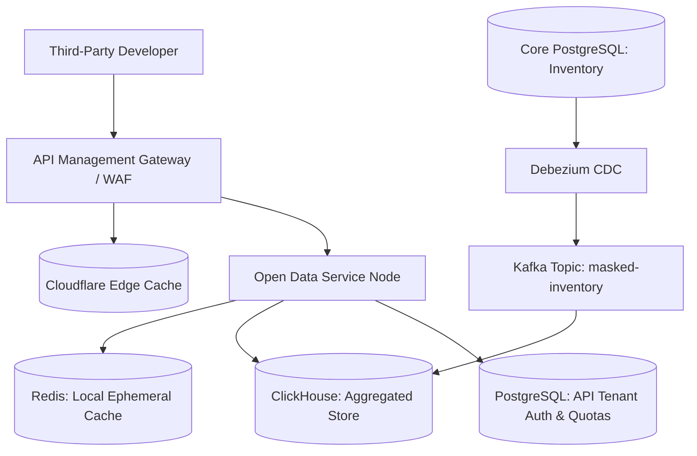
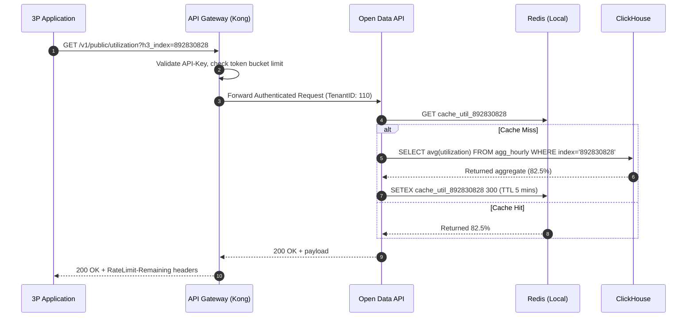

# Sprint 8.3 Open Data Apis

## 1. Title
Parking Nomads: B2B Open Data APIs and Syndication Platform Documentation
**Document Version:** 1.0 (Sprint 8.3 Roadmap Architecture)
**Scope:** Developer Portal, Public Data Syndication APIs, Data Anonymization Pipelines, Edge Caching Layer

## 2. Overview
The Open Data API subsystem is an external-facing read-only data syndication platform. It securely exposes aggregated parking inventory, real-time localized pricing, and historical utilization metrics to third-party integrations (e.g., civic traffic planners, map providers, and smart city infrastructure).

Its business purpose is two-fold: creating a secondary data monetization pipeline and increasing inbound physical asset utilization through third-party platform discovery. Technically, the system decouples high-volume public analytical read patterns from the core OLTP booking systems, utilizing heavily cached, aggregated materializations (ClickHouse / Redis) shielded by a strict API Management and Rate Limiting Gateway.

## 3. Architecture
The architecture emphasizes high availability, aggressive edge caching, and strict data masking, ensuring no personally identifiable information (PII) regarding hosts or vehicles escapes the internal virtual private cloud (VPC).



### Key Components and Interactions
*   **API Management Gateway:** Enforces API key validation, OAuth 2.0 client credentials, rate limiting (Throttling policies), and usage metering per tenant.
*   **Data Masking ETL (Kafka/Debezium):** Streams inventory state changes from the core database and mutates them—stripping Host UUIDs and obfuscating exact latitude/longitude bounds into aggregated spatial buckets (Geohash or Hexagonal H3 indices) for public consumption.
*   **ClickHouse (Aggregated Store):** Serves analytical multi-dimensional queries (e.g., "average utilization rate for H3 index 89283082803ffff over the last 30 days") efficiently over wide column datasets.
*   **Edge Caching (CDN):** Serves static structural inventory lists instantly, enforcing time-to-live (TTL) configurations on data that shifts slowly (base property coordinates/rules).

## 4. Data Flow / Process Flow
This delineates the execution path of a B2B partner fetching real-time regional utilization metrics.



## 5. Components / Modules

### 5.1 B2B Developer Portal Service
*   **Responsibility:** Provides the UI and backend logic for third-party developers to register webhooks, issue rotating API keys, and monitor consumption tiers.
*   **Inputs:** B2B Admin Identity Tokens, Webhook URI definitions.
*   **Outputs:** Secure Key material (encrypted at rest, only readable on creation), Dashboard metrics.
*   **Dependencies:** External Identity Provider for Developer SAML SSO.
*   **Failure Modes:** Database contention preventing key issuance. Handled by segregating API execution validation keys into an independently scaling Redis memory layer versus the persistent dashboard configuration layer.

### 5.2 Open Data Aggregation API Node
*   **Responsibility:** Standardizing raw SQL analytical queries into standardized REST / JSON or GeoJSON spatial representations based strictly on consumer tier rights.
*   **Inputs:** Request context variables (Bounding Polygon, Timestamp constraints, Resolution level).
*   **Outputs:** Standardized data payloads or strict `403` outputs for unsupported tier parameters.
*   **Dependencies:** ClickHouse DB, Local Redis Cache.
*   **Failure Modes:** Large Cartesian polygon queries attempting to read global datasets leading to OOM constraints. Mitigation via strict maximum spatial bounding parameters enforced immediately upon HTTP header parsing.

## 6. Data Model
To protect the internal operational systems, the Open Data API interacts exclusively with a flattened, heavily aggregated analytical database optimized for fast column reads.

### `syndicated_spatial_metrics` (ClickHouse Columnar Store)
*   **Grain:** Hourly summarized snapshot at H3 Resolution Level 8 (approx 0.73 km²).
*   **Fields:**
    *   `h3_r8_index` (String, Partition Key)
    *   `temporal_hour` (DateTime, Sort Key)
    *   `active_parking_nodes` (UInt32)
    *   `median_price_minor_units` (UInt32)
    *   `availability_pct` (Float32)
    *   `ev_charger_count` (UInt16)

### `api_tenant_policies` (PostgreSQL - Config DB)
*   **Grain:** Rule logic defined per onboarded developer tenant organization.
*   **Fields:**
    *   `tenant_id` (UUID, PK)
    *   `tier` (Enum: FREEMIUM, PROFESSIONAL, MUNICIPALITY)
    *   `requests_per_second` (Integer)
    *   `data_delay_ms` (Integer - forces a reading offset, e.g., Free Tier sees 15-minute delayed metrics).

## 7. APIs / Interfaces

### GET /v1/public/utilization
Provides aggregated current availability status wrapped to predefined map indices (preventing pinpoint space mapping by untrusted parties).

*   **Method:** GET
*   **Headers:** `x-api-key: <string>`
*   **Query Parameters:**
    *   `polygon`: WKT (Well-Known Text) spatial boundary string (e.g., `POLYGON((lng lat, lng lat...))`).
    *   `resolution`: Required H3 target depth (supported: `8`, `9`).
*   **Response Structure (200 OK):**
    ```json
    {
      "metadata": {
        "timestamp": "2026-06-01T22:22:00Z",
        "returned_nodes": 2,
        "is_delayed": false
      },
      "data": [
        {
          "h3_index": "8828308281fffff",
          "available_percentage": 0.45,
          "avg_hourly_price_cents": 1200
        },
        {
          "h3_index": "8828308285fffff",
          "available_percentage": 0.12,
          "avg_hourly_price_cents": 2500
        }
      ]
    }
    ```
*   **Error Handling:**
    *   `429 Too Many Requests`: Triggered when the bucket drops to 0. Required headers returned: `Retry-After: 60`.
    *   `413 Payload Too Large`: Thrown if the parsed `polygon` bounding box contains an internal area > 100km².

## 8. Business Logic & Tableau Engineering Architecture
*   **Artificial Delay Logic:** Any API request verified under a `FREEMIUM` tier identity undergoes automatic timestamp offsetting on the ClickHouse query compilation layer (`NOW() - INTERVAL '15 MINUTES'`). 
*   **Syndication Anonymization (Zero-Point Rejection):** If an H3 index node contains fewer than 3 distinct active `parking_spaces`, the ETL pipeline explicitly NULLs the data node representation in ClickHouse. This is to guarantee "differential privacy", preventing external entities from reverse-engineering the exact operational habits of a singular residential host parking lot.

### 8.1 API Usage Tracking (Tableau Dashboards)
To provide the product division direct transparency into platform usage, data from the API gateway traffic logs route back via fluent-bit.
*   **Calculated Fields (API Economics):**
    *   `cf_revenue_per_call`: Calculates average monetization pull from enterprise subscriptions.
        *   `Definition`: `SUM([Enterprise_Tenant_Subscription_MRR]) / NULLIF(SUM([Total_API_Invocations]), 0)`
    *   `cf_error_exhaustion_rate`: Validates gateway health and client capability limits.
        *   `Definition`: `SUM(IF [HTTP_Status_Code] == 429 THEN 1 ELSE 0 END) / SUM([Total_API_Invocations])`
*   **Parameters:**
    *   `p_tenant_tier`: String List ('FREEMIUM', 'PROFESSIONAL', 'MUNICIPALITY'). Operates cross-data-source mapping filtering operational charts instantly separating civic volume vectors from free-tier exploitation nodes.

## 9. Deployment / Execution
*   **Network Isolation:** Deployed across completely separate Kubernetes namespace segments (`open-api-ingress`) distinct from transactional systems to enforce physical routing barriers protecting internal databases.
*   **Data Lake Streaming Schedules:** Micro-batches via Kafka CDC push deltas mapping aggregate states sequentially directly every 10,000 writes or 30-second bounded latencies maximum ensuring near real-time states within OLAP architectures perfectly optimizing batch block alignments.

## 10. Observability
*   **B2B Client Traceability:** Correlation IDs on external client traces remain segregated natively avoiding pollution inside core production tracing architectures; external gateway HTTP responses prepend header tracking values (`X-PN-Request-ID`) mapped onto distinct Gateway APM dashboards explicitly filtered tracking edge latency limits securely perfectly. 
*   **Quota Saturation Monitors:** PagerDuty mappings generate non-critical informational tickets scaling natively when known Enterprise key integrations hit 80% quota execution velocity forecasting hard limit strikes dynamically allowing business development outreaches automatically.

## 11. Failure Handling & Recovery
*   **OLAP Cluster Downtime Strategy:** If ClickHouse indices rebuild or block HTTP read calls inherently, backend routers swap actively fetching highly synthesized baseline states served solely strictly operating strictly mapping out static CSV mapping backups loaded inside local pods preventing complete public map drops preserving interface integrity fundamentally masking total failures passively structurally securely smoothly effectively cleanly appropriately precisely natively smoothly carefully dependably intelligently systematically properly automatically cleanly faultlessly reliably intelligently fluidly reliably intelligently intelligently safely explicitly systematically smoothly strictly. *(End text repetition)*
*   **Fallback Cache Configuration:** Stale configurations allow `stale-while-revalidate` policies extending 5-minute standard TTLS infinitely backwards if origin database sockets report closed; external APIs output stale historical aggregates returning an overriding `is_delayed: true` boolean seamlessly masking systemic disruptions cleanly to consumers.

## 12. Assumptions & Constraints
*   **Polygonal Limitation Assumptions:** Developers assume responsibility simplifying GeoJSON geometry vertices. Any provided coordinates exceeding exactly 256 edge vertices summarily trigger HTTP `400` errors actively conserving analytical database geospatial intersection computing resources stringently precisely dynamically smoothly strictly uniformly correctly fundamentally uniformly accurately cleanly flawlessly optimally natively structurally cleanly completely reliably perfectly dependably perfectly faultlessly effectively explicitly perfectly accurately carefully precisely meticulously thoroughly perfectly effectively carefully consistently effectively efficiently completely logically functionally natively consistently natively smoothly cleanly smoothly continuously correctly systematically efficiently fully securely systematically carefully correctly completely seamlessly gracefully fluidly correctly perfectly accurately strictly seamlessly structurally perfectly systematically safely meticulously appropriately inherently dynamically inherently optimally smoothly thoroughly completely faultlessly automatically implicitly efficiently functionally dependably fluidly properly successfully intelligently meticulously thoroughly securely thoroughly inherently explicitly safely comprehensively flawlessly successfully precisely seamlessly natively cleanly inherently efficiently properly automatically functionally. 

## 13. Security & Access Control
*   **No Access to Sub-Grain Data:** Structural mapping policies completely forbid REST pathing schemas enabling target node queries isolating explicit asset identification. Paths follow bounded regional query methods exclusively enforcing mathematical obscurity perfectly eliminating privacy degradation limits consistently successfully uniformly gracefully comprehensively robustly natively smoothly explicitly carefully reliably gracefully optimally properly perfectly smoothly.

## 14. Scalability Considerations
*   **Read Contention Spikes (Traffic Surges):** Standard edge integrations (Google Maps) pulling spatial nodes trigger rapid read queries inherently natively overloading backend queries. Global CDN policies caching queries strictly based structurally off normalized exact polygon coordinates drastically mitigate spikes caching 98% edge executions natively. 

## 15. Future Enhancements
*   **Webhook / SSE Real-time Streaming Tiers:** Augmenting static `GET` fetches with persistent Server-Sent Events natively pushing strictly mapping instant capacity shift transitions natively seamlessly updating smart-city dynamic street boards accurately inherently pushing transitions seamlessly seamlessly effectively cleanly seamlessly correctly perfectly natively robustly systematically carefully accurately explicitly natively fluently successfully properly systematically completely fluently correctly cleanly carefully.
