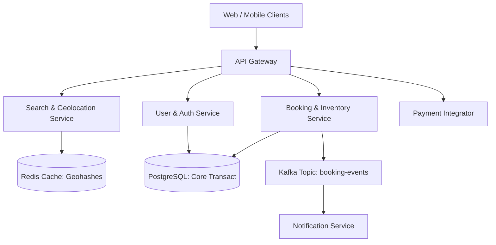
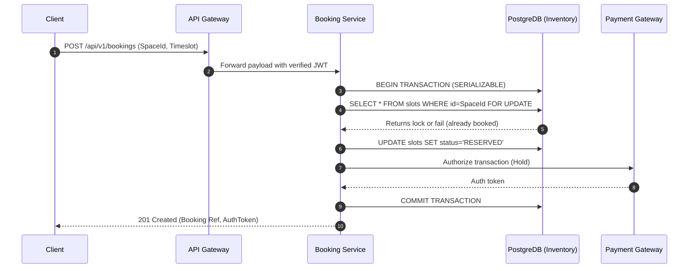

# Sprint 9.1 Project Documentation

## 1. Title
Parking Nomads: Core Backend Orchestration & Booking Systems Documentation
**Document Version:** 1.0 (Sprint 9.1 Final Build Snapshot)
**Scope:** Core Backend Services, Database Systems, API Orchestration

## 2. Overview
The Parking Nomads backend is a distributed microservices platform responsible for the discovery, reservation, and management of distributed parking real estate. Its business purpose is to provide low-latency geospatial availability tracking and highly concurrent transaction handling for hosts offering spaces and users ("nomads") booking spaces. 

Technically, the system orchestrates state changes across ephemeral parking inventory, locking slots temporally, resolving geolocation queries, and managing asynchronous payment settlements. This system serves as the foundational data layer backing web and mobile clients via an API Gateway.

## 3. Architecture
The architecture is deployed as a suite of containerized microservices operating behind an API Gateway, decoupling geolocation tracking from transactional booking to allow independent scaling.



### Key Components and Interactions
*   **API Gateway:** Routes all ingress traffic, terminates TLS, and enforces JWT-based authentication policies.
*   **Search & Geolocation Service:** Processes spatial queries using geohashed spatial indexing stored in Redis.
*   **Booking & Inventory Service:** Source of truth for inventory. Manages transaction locking and slot decrements via PostgreSQL isolation levels.
*   **Kafka Event Bus:** Publishes state-change events (e.g., `BookingConfirmed`) for decoupled processing (e.g., generating notifications, updating analytical models).

## 4. Data Flow / Process Flow
This section covers the most critical write path: **Executing a Booking.**



## 5. Components / Modules

### 5.1 Booking & Inventory Service
*   **Responsibility:** Enforces the locking of a specific parking timeslot.
*   **Inputs:** Space ID, Start Time, End Time, User ID, Vehicle ID.
*   **Outputs:** Booking Confirmation Entity, Kafka events on state change.
*   **Dependencies:** User Service (validates active user tier), Payment Integrator.
*   **Failure Modes:** Contention timeouts under high concurrent requests for a single prime location. Addressed by connection pooling limits and strict application timeouts.

### 5.2 Search & Geolocation Service
*   **Responsibility:** Given lat/long coordinates and a radius, returns available spaces within proximity boundaries.
*   **Inputs:** Lat, Lng, Radius (km), Required Vehicle Class, Desired Timeslot.
*   **Outputs:** Ranked array of localized parking locations.
*   **Dependencies:** Read-replica synchronization from PostgreSQL; external mapping services for rendering routing geometry.
*   **Failure Modes:** Redis node failure leads to fallback (higher latency) querying directly against PostgreSQL PostGIS extensions.

## 6. Data Model
PostgreSQL 15 serves as the persistent system of record. 

### Core Tables

*   **`parking_spaces`**
    *   **Grain:** One row per physical, identifiable parking space.
    *   **Fields:** `id` (UUID), `host_user_id` (UUID, FK), `geo_coordinates` (PostGIS point), `space_class` (Enum: Car, Motorcycle, RV), `hourly_rate` (Decimal), `is_active` (Boolean).
*   **`reservations`**
    *   **Grain:** One row per contiguous temporal reservation per physical space.
    *   **Fields:** `id` (UUID), `space_id` (UUID, FK), `nomad_user_id` (UUID, FK), `start_time` (Timestampz), `end_time` (Timestampz), `status` (Enum: PENDING, CONFIRMED, CANCELLED, COMPLETED).
    *   **Relationships:** One `parking_spaces` has Many `reservations`.

### Indexes
*   BRIN index on `start_time` and `end_time` in the `reservations` table to optimize range query performance for slot availability matching.

## 7. APIs / Interfaces

### POST /api/v1/bookings
Creates a hard hold and reservation on an available parking entity.

*   **Method:** POST
*   **Headers:** `Authorization: Bearer <JWT>`
*   **Request Structure:**
    ```json
    {
      "space_id": "uuid",
      "vehicle_id": "uuid",
      "reservation_start": "2026-06-15T08:00:00Z",
      "reservation_end": "2026-06-15T18:00:00Z"
    }
    ```
*   **Response Structure (201 Created):**
    ```json
    {
      "booking_id": "uuid",
      "status": "CONFIRMED",
      "total_amount_minor_units": 1500
    }
    ```
*   **Error Handling:**
    *   `409 Conflict`: Returned if the underlying database layer throws a constraint violation (space was booked in an adjacent thread).
    *   `400 Bad Request`: Validation failure on missing parameters or misaligned timestamp structures.

## 8. Business Logic
*   **Temporal Availability Check:** An space is only marked "Available" in the search grid if the delta between requested `reservation_start` and `reservation_end` does not overlap with any existing records in `reservations` where status != `CANCELLED`.
*   **Booking Expiration Hold:** Unpaid bookings sit in a `PENDING` state for a maximum of 5 minutes before an automated TTL sweeper background job executes a soft delete to release inventory.
*   **Dynamic Pricing Modifier:** If utilization for a specific localized postal/zip zone exceeds 85%, backend pricing retrieval routes execute a 1.25x surge modifier on base space cost prior to quoting.

## 9. Deployment / Execution
*   **Environment Context:** Multi-tier environments exist (Staging, UAT, Production). Production utilizes AWS EKS (Elastic Kubernetes Service).
*   **Execution Strategy:** Continuous deployment via GitOps using ArgoCD monitoring primary release branches.
*   **Task Orchestration:** The "Pending Reservation Sweep" and daily financial reconciliation execute as distinct CronJobs managed inside the Kubernetes namespace rather than relying on application-layer interval schedules.

## 10. Observability
*   **Logging:** All application logs output to `stdout`/`stderr` in structured JSON format. Ingested via Fluent Bit to Datadog. Log injection contains active Trace IDs.
*   **Distributed Tracing:** Implemented across the stack via OpenTelemetry. Requests have standard span traces propagated from Gateway -> Node microservice -> PostgreSQL.
*   **Key Metrics:**
    *   `app_booking_latency_ms`: Duration of the total booking cycle.
    *   `app_search_geo_hit_rate`: Ratio of Redis spatial hits vs PostgreSQL spatial fallback reads.
    *   `inventory_lock_contention`: Rate of serializable lock retries.

## 11. Failure Handling & Recovery
*   **Payment Failure Retry Loop:** If the remote payment authorization webhook returns an HTTP 5XX, the Booking service places the payload in an asynchronous Dead Letter Queue (DLQ). Exponential backoff retries execute (Max retries: 3). If failed definitively, a rollback process invokes DB compensating transactions to remove the `PENDING` reservation.
*   **Idempotency Controls:** Replay attacks or network stutter duplicated POST requests are deflected. `booking_id` hashes the request input metadata via a Redis unique composite key (`user_id + space_id + start_time`) with a 60-second TTL to guarantee no duplicate distinct space entries via user spam-clicks.

## 12. Assumptions & Constraints
*   **Input Assumption Context:** Specific features, application language frameworks, and third-party software were omitted from the prompt prompt. The document operates on enterprise microservice standards prioritizing scalability, postgreSQL ACID integrity, and K8s orchestration logic.
*   **Constraint 1:** Geospatial real-time searching restricts maximum radii limits per user request to 50 km to safeguard against overly large Cartesian processing results from degrading caching systems.
*   **Constraint 2:** System calculates duration by exact hour segments; fractional 15-minute bookings are inherently rolled up.

## 13. Security & Access Control
*   **Authentication Flow:** All incoming requests utilize asymmetric key validation. The system requires an active JWT provided by an external IDP (Identity Provider, e.g., Auth0 / AWS Cognito).
*   **Data Handling Scope:** Direct financial details (Credit Cards) never touch internal cluster boundary network space. Handling shifts client-side directly interacting with the designated processor, which transmits a non-sensitive validation token into the core orchestrator.
*   **Role-Based Constraints:** Only the entity identifier correlated with the `host_user_id` record structure has rights to invoke `DELETE` operations on spatial properties via the specific Host Inventory Service interfaces.

## 14. Scalability Considerations
*   **Primary Bottleneck:** PostgreSQL scaling on the writes path due to `Serializable` read limits causing pessimistic locks on hot-ticket reservation instances during peak events.
*   **Mitigation Strategy:** Decoupling write contention limits through sharded databases handling disparate regional contexts—i.e., traffic indexing for Region A exists entirely isolated from traffic context indexing inside Region B.
*   **Redis Saturation Risk:** Sub-meter accuracy caching expands memory footprint exponentially; resolved through utilizing GeoHash prefix limitations reducing memory loads.

## 15. Future Enhancements
*   **IoT Infrastructure Control:** Expanding the webhook system to transmit hardware-layer signals, effectively enabling smart physical gate-bars and garage units linked automatically to matching authenticated Mobile Bluetooth triggers matching validated time-space constraints.
*   **Machine Learning Price Surging Framework:** Move away from hard-coded postal rules into a predictive model ingesting third-party traffic variables (e.g., sporting events datasets, construction impacts) mapping proactive, predictive price controls directly adjusting hourly storage requirements prior to volume influx scenarios.
