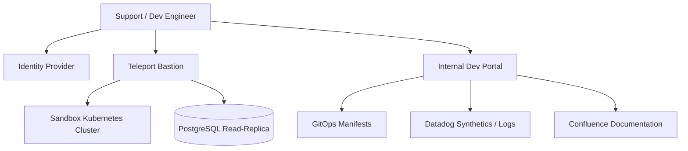
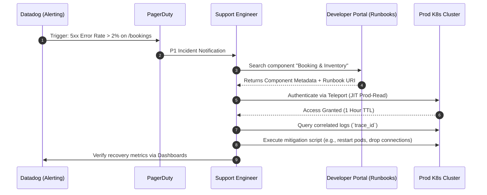

# Sprint 9.2 Training And Knowledge Transfer

## 1. Title
Parking Nomads: Engineering Enablement & Operational Runbook Knowledge Transfer Framework
**Document Version:** 1.0 (Sprint 9.2 Final Build Snapshot)
**Scope:** Level 2/3 Support Handover, Developer Onboarding Environments, Diagnostic Tooling

## 2. Overview
The Engineering Enablement Framework is the localized operational scaffolding required for the transition of the Parking Nomads core platform from active Sprint development to sustained engineering and support. 

Its business and technical purpose is to minimize the Time To Restore Service (TTRS) and optimize engineer onboarding velocity by standardizing local diagnostic environments, automating access provisioning, and codifying incident response sequences. This system sits alongside the primary production environment, serving as the management plane for training, access control, and diagnostic operations.

## 3. Architecture
The operational enablement architecture decouples production traffic handling from diagnostic execution. It relies on identity-aware proxying, localized synthetic environments, and structured telemetry dashboards.



### Key Components and Interactions
*   **Teleport Bastion Gateway:** Zero-trust access layer enforcing Just-In-Time (JIT) permissions for specific pods or database read-replicas based on SSO groups.
*   **Backstage Developer Portal:** The centralized catalog for all Parking Nomad microservices, housing real-time ownership metadata, SLA definitions, and immediate runbook links.
*   **Sandbox Environments:** Ephemeral namespaces (`kt-sandbox-{username}`) generated via developer pipelines for destructive operational training and state-mutation debugging.
*   **Telemetry Analytics Console:** Pre-configured Datadog APM views abstracting high-volume logs into isolated transaction flows (e.g., filtering traces strictly by the `booking_events` Kafka topic).

## 4. Data Flow / Process Flow
This section covers the codified procedure an operational engineer follows when alerted to an anomaly requiring runbook execution.



## 5. Components / Modules

### 5.1 Local Execution Sandbox CLI (`pn-cli`)
*   **Responsibility:** Automates the local teardown, build, and simulated data seeding for training new engineers on state manipulation.
*   **Inputs:** `make kt-env-up`, `make inject-mock-traffic`
*   **Outputs:** Local Minikube environment initialized with pre-seeded PostGIS data.
*   **Dependencies:** Docker, Helm, AWS CLI, locally running Docker daemon.
*   **Failure Modes:** Resource exhaustion (OOM kill) on local host if allocating insufficient RAM (Minimum requirement: 16GB dedicated). 

### 5.2 Internal Developer Portal (Backstage IDP)
*   **Responsibility:** Aggregates documentation, ownership, and health states into a single UI pane.
*   **Inputs:** System definition `yaml` files mapped in all code repository root directories.
*   **Outputs:** Web interface providing standardized component maps.
*   **Dependencies:** GitHub API (for manifest parsing), Datadog API.
*   **Failure Modes:** Desynchronization if a service relocates Git repositories without updating the corresponding manifest definition.

## 6. Data Model
To track ongoing training effectiveness and required system documentation modifications, an internal operational metrics schema is maintained in a dedicated metadata database.

### `incident_kt_mapping` Table
*   **Grain:** One record per post-mortem or successfully resolved operational alert.
*   **Fields:** 
    *   `id` (UUID, Primary Key)
    *   `incident_ref` (String, Jira ticket mapping)
    *   `root_cause_component` (String)
    *   `runbook_id` (UUID, Foreign Key mapped to technical docs)
    *   `knowledge_gap_identified` (Boolean) - Defines if KT documentation requires an update based on resolution path.

## 7. APIs / Interfaces
As part of the system handoff, a restricted operational API was exposed directly on the internal VPC network for SRE execution scripts.

### POST /ops/v1/sandbox/seed-data
Generates synthesized geo-coordinates and bookings for a target test environment, enabling risk-free training iterations.
*   **Method:** POST
*   **Headers:** `Authorization: Bearer <Admin-JWT>`
*   **Request Structure:**
    ```json
    {
      "target_namespace": "kt-sandbox-dev1",
      "mock_inventory_count": 500,
      "simulate_contention_ratio": 0.2
    }
    ```
*   **Response Structure (202 Accepted):**
    ```json
    {
      "job_id": "seed-job-119",
      "status": "PROVISIONING",
      "estimated_completion_seconds": 120
    }
    ```

## 8. Business Logic
*   **Service Tier Constraints:** Production debugging operations strictly execute on `Read-Replica` PostgreSQL databases. Explicit CLI overrides utilizing Break-Glass JIT roles are required to invoke state changes in the production tier.
*   **Access Governance Logic:** Engineering training exercises (`mock_inventory_count > 0`) cannot be invoked unless the `target_namespace` parameter strictly prefix-matches `kt-sandbox-*`. Any operational attempt targeting `production` or `staging` namespace drops via RBAC validation.

## 9. Deployment / Execution
*   **KT Workshops:** Synchronous execution paths for developers. Handled locally via localized cluster configuration mirroring production environment configurations precisely.
*   **Onboarding Schedules:** The onboarding documentation generation pipeline runs a nightly CronJob against main Git branches. This converts markdown `RUNBOOK.md` references via MkDocs into statically hosted artifacts ensuring engineers always train on matching release states.

## 10. Observability
*   **Training & Execution Logging:** Support engineer execution commands routed via Teleport bastion are keystroke-logged and centralized in AWS CloudTrail for auditing.
*   **Metrics on KT Efficacy:** Tracking queries per onboarding module (Time to First Commit, Time to Local Environment Spin-up). Dashboards expose latency outliers where system dependency downloads consistently fail locally.
*   **Monitored SLA Thresholds:** If support triage surpasses 15 minutes, automated triggers escalate from local debugging KT protocols to designated System Architect direct contact lists.

## 11. Failure Handling & Recovery
*   **Desynchronized Local Sandbox:** During engineering exercises, corrupted local data states require deterministic recovery. Procedure: execute `make kt-clean-all`. This purges Docker volumes, stale Minikube states, and hanging orphaned Kafka topics, executing a baseline state reset within 3 minutes.
*   **Bastion Connection Failures:** In the event of Teleport authorization pipeline timeouts, operational manuals explicitly authorize local Break-Glass SSH credentials (rotating 12-hour validity) strictly tied to localized secure hardware devices (YubiKey verification).

## 12. Assumptions & Constraints
*   **Assumption 1:** Incoming operational and development engineers possess active CKA (Certified Kubernetes Administrator) baseline equivalent knowledge prior to utilizing advanced operational deployment sandboxes.
*   **Assumption 2:** Training data models replicate North American (US) longitudinal mapping boundaries; localized coordinate synthetics will fall back to zero defaults if simulating deep global geometries (e.g., isolated APAC or LATAM coordinate generation).
*   **Limitation:** Sandboxing operations currently cannot simulate true distributed latency across multi-regional architectures; cross-region transactional locking conflicts are tested theoretically rather than pragmatically during training.

## 13. Security & Access Control
*   **Role Based Tiers:** 
    *   *Dev-KT:* Granted sandbox generation and staging log aggregation permissions.
    *   *SRE-Operator:* Granted read replica db access, temporary application rollout restarts via ArgoCD interface.
*   **Data Masking Validation:** Operational KT procedures enforce token masking. Raw JSON access inside training namespaces scrubs all Personally Identifiable Information (PII)—including phone numbers and exact billing vectors via backend parsing pipelines before ingestion to localized monitoring instances.

## 14. Scalability Considerations
*   **KT Resource Limits:** The `seed-data` APIs allocate temporary infrastructure pods. A concurrency limit of 15 simultaneous sandboxes prevents the shared training CI/CD cluster node-pool from exhausting CPU cycles and inducing localized thrashing.
*   **Knowledge Maintenance Saturation:** As the microservices topology scales (N > 25 discrete services), runbook updates manually managed become stale. Scaling documentation shifts relies entirely on git-hook linting constraints preventing PR merges if modifying component topology without a mirrored `runbook.md` version tag bump.

## 15. Future Enhancements
*   **AIOps Runbook Summarization:** Implementation of localized Large Language Model integration to process stack traces directly inside the PagerDuty integration workflow. This provides arriving L2 Support Engineers with isolated context, minimizing cognitive overload from digging into verbose historical telemetry logs manually.
*   **Automated Root-Cause Correlation (Chaos Engineering):** Evolving the knowledge transfer sandboxes from manual injection points into scheduled Chaos Mesh deployments simulating failure mechanisms unprompted against L2 team staging deployments directly verifying their TTRS capability passively.
