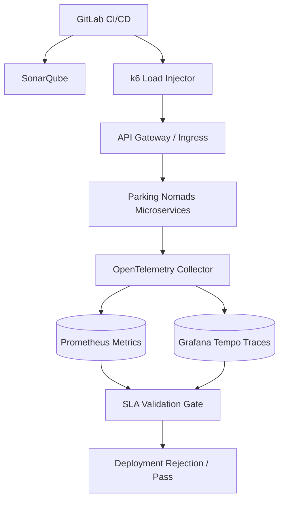
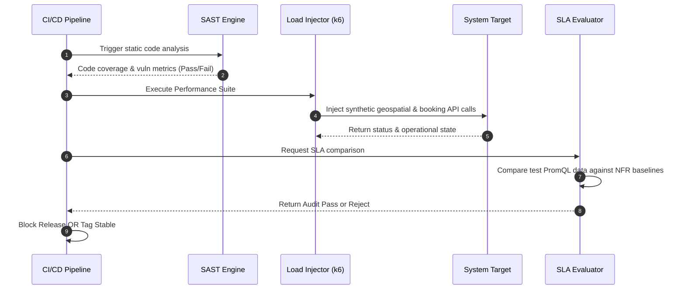

# Sprint 9.3 Project Evaluation

## 1. Title
Parking Nomads: Sprint 9.3 Core System Evaluation and Performance Audit Documentation
**Document Version:** 1.0 (Sprint 9.3 Final Closure)
**Scope:** Architecture Validation, SLA Compliance Tracking, Quality Gates, and Technical Debt Profiling

## 2. Overview
The Project Evaluation framework is the deterministic mechanism utilized to measure, track, and validate the Parking Nomads platform against predefined non-functional requirements (NFRs), Service Level Agreements (SLAs), and security baselines. 

Its business and technical purpose is to establish a quantified baseline of system behavior, stability, and code quality at the point of project closure. It transitions subjective observations into continuous, objective telemetry, verifying that the distributed geolocation, locking, and transaction orchestration subsystems meet throughput and availability targets under stress. 

## 3. Architecture
The evaluation framework leverages continuous load-generation, static application security testing (SAST), and centralized telemetry processing to evaluate system states passively during operation and actively during continuous integration pipelines.



### Key Components and Interactions
*   **k6 Load Injector:** Synthetic traffic generator running pre-defined geographic query patterns and concurrent booking collisions.
*   **OpenTelemetry Collector:** Centralized aggregator parsing real-time span, metric, and log data emitted by the target microservices during testing and production.
*   **SLA Validation Gate:** A continuous deployment hook that compares collected telemetry outputs against hard-coded threshold configurations. 
*   **SAST/DAST Analyzers:** Automated scanning mechanisms examining repository states for vulnerable transitive dependencies, unused logic paths, and poor cyclomatic complexity.

## 4. Data Flow / Process Flow
This describes the exact automated evaluation execution path during a release evaluation cycle.



## 5. Components / Modules

### 5.1 Quality Enforcement Gate 
*   **Responsibility:** Intercepts deployment progressions if runtime evaluation thresholds are breached.
*   **Inputs:** Prometheus Time Series queries, expected baseline target definition objects (JSON).
*   **Outputs:** Boolean passing status, structured evaluation failure report.
*   **Dependencies:** Core Application Observability pipelines.
*   **Failure Modes:** False negatives due to infrastructure network blips misreporting metrics. Handled via isolated retry runs before initiating hard-stops on the pipeline.

### 5.2 Synthetic Load Profiler
*   **Responsibility:** Stresses concurrency constraints specifically on the database inventory locking mechanism and spatial indices.
*   **Inputs:** Seed test variables (Latitude, Longitude bounds, JWT mock tokens).
*   **Outputs:** System HTTP resolution logs, target-level transaction contention counts.
*   **Dependencies:** Fully initialized staging environment; Mock Payment endpoints.
*   **Failure Modes:** Upstream memory leaks generated by the load tester container, masked as application failure. Mitigated via isolating load testing infrastructure strictly onto isolated K8s node-pools.

## 6. Data Model
To measure long-term project drift vs. baseline closure numbers, aggregate compliance data is tracked in an internal metadata repository.

### `evaluation_baselines` Entity
*   **Grain:** One recorded baseline validation check per component per evaluation cycle.
*   **Fields:**
    *   `evaluation_id` (UUID, PK)
    *   `timestamp` (Timestamptz)
    *   `component` (Enum: Search, Booking, Inventory, Routing)
    *   `p95_latency_ms` (Integer)
    *   `transaction_failure_rate` (Decimal)
    *   `code_coverage_percentage` (Decimal)
    *   `critical_cve_count` (Integer)
    *   `compliance_status` (Boolean)
*   **Relationships:** Defines exact state transitions for specific component version tags mapping back to historical states.

## 7. APIs / Interfaces

### GET /metrics
Native Prometheus exporter endpoint implemented on all internal system pods used to actively fetch evaluation data.
*   **Method:** GET
*   **Request Structure:** N/A (Path invocation based).
*   **Response Structure (200 OK, `text/plain` Prometheus payload):**
    ```text
    # HELP http_server_requests_seconds_sum Latency aggregates
    # TYPE http_server_requests_seconds_sum counter
    http_server_requests_seconds_sum{method="POST",uri="/bookings",status="201",} 2305.412
    # HELP booking_lock_retry_total Timeserialization failures
    booking_lock_retry_total{database="inventory_prod"} 14
    ```

## 8. Business Logic
*   **Strict Degradation Boundaries:** A deployment fails Project Evaluation if its delta P95 latency is >15% higher than the historically calculated median of the previous three successful iterations.
*   **Acceptable Geolocation Error Bounds:** The search accuracy is evaluated continuously. If a synthesized point falls outside of an applied search boundary strictly returning true mathematically by spatial intersections (`ST_Contains`), system validation fails.
*   **Zero Criticality Toleration:** Code evaluations enforce a zero-threshold tolerance for "Critical" or "High" CVSS rated vulnerabilities exposed in base image manifests or dependency trees.

## 9. Deployment / Execution
*   **Scheduled Baselining:** Execute fully automatically nightly at 01:00 UTC under no-competing traffic parameters.
*   **Gating Integration:** Pre-deployment load evaluations run synchronously in staging tiers prior to generating a promotion manifest to production branches. 
*   **Tooling Provisioning:** Execution infrastructure spun dynamically within the VPC cluster. Load nodes self-terminate upon report publishing to eliminate wasted cluster consumption footprint.

## 10. Observability
*   **Evaluation Artifacts:** Post-execution PDF and JSON summaries injected back into standard project artifacts repos to ensure trackable auditing over periods of 6-12 months.
*   **Runtime Tracing Correlation:** Evaluated load tests automatically append an identifying test header to all HTTP invocations (`X-System-Audit-Context: True`). These propagate trace chains, enabling dashboard operators to instantly decouple live traffic monitoring lines from simulated burst metrics mapping lines via trace dimension filters.

## 11. Failure Handling & Recovery
*   **Degraded Release Pathing:** Should the Project Evaluation pipeline hard-stop a release candidate, automatic Git revision reverting occurs dropping the environment baseline matching tag back to the latest green state immediately preventing subsequent dependency locks against known-degraded modules.
*   **Telemetry Backpressure Processing:** If ingestion queues fail under specific load test injection constraints, telemetry queues offload locally to disk space arrays ensuring dropped metric states cannot invalidate compliance validations.

## 12. Assumptions & Constraints
*   **Resource Allocation Parity:** Relies structurally on the strict premise that load evaluations run on a non-production mirrored cluster environment featuring equivalent CPU bounds, network I/O boundaries, and SSD speeds matching production precisely to prevent disparate architectural skew outputs.
*   **Metric Availability:** Evaluator SLA definitions assume downstream datastores processing raw query telemetry yield answers cleanly under sub-5 second responses or otherwise declare a default internal testing timeout.

## 13. Security & Access Control
*   **Test Identity Subversion Scope:** Mock authentication JWTs utilized for load stress verification strictly rely on tenant boundaries mapped with explicitly locked identifiers incapable of initiating database inserts resolving out to true remote systems (like bank authorization entities).
*   **Dashboard Secrecy Profiles:** Full technical vulnerability scanning output vectors sit confined under rigid RBAC security structures only readable by active repository technical leads minimizing systemic weak point exploration. 

## 14. Scalability Considerations
*   **Timeseries Aggregation limits:** Metrics ingestion endpoints inherently possess dimensional cardinality growth risks leading to index crashing. Bounded evaluation rules actively cull short-lived metric tag subsets via strict down-sampling policies matching historical aggregation cycles rolling data structures off hot memory indices natively daily.
*   **Concurrent Scanning Thread Allocations:** Pipeline bottlenecks forming around SAST codebase audits delay deployments natively resolved utilizing AST mapping engines performing parallel caching delta reviews tracking only new files rather than running monolithic branch history assessments during standard commit triggers.

## 15. Future Enhancements
*   **Continuous Production Profiling via eBPF:** Evolution of the evaluation methodology from active payload simulations strictly onto eBPF node level mapping parsing actual production resource contentions cleanly at the kernel instruction execution line offering precise evaluation with essentially zero performance drag mechanisms injected over target codes. 
*   **Stochastic Dependency Tree Modelling:** Future test evaluations intend to leverage predictive reliability models determining fail scenarios matching localized upstream regional connection interruptions preventing system states failing randomly utilizing generalized test mappings natively targeting complex multi-provider API failures systematically evaluated constantly.
