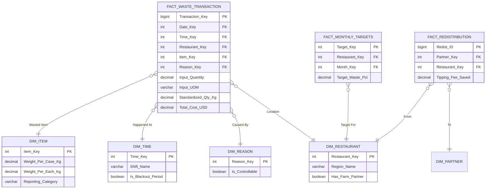

# Project Phoenix Bible
## Section 7: Data Model & Schema Specification (The "Phoenix Star")

**Document Owner:** Principal Data Architect
**Date:** October 15, 2024
**Scope:** Conceptual, Logical, and Physical Data Models for Power BI & SQL
**Status:** **Approved for Engineering**


### 7.0 Critique of the Draft Model
The draft model provided above is a strong "V1" (Standard Star Schema), but based on the complexity revealed in Phases 2 and 3—specifically the **Unit of Measure (UOM) conflicts**, the **Time-of-Day operations**, and the **Yield Logic**—it requires hardening.

**Deficiencies in a Standard Schema vs. Reality:**
1.  **The "Pinch" vs. "Kg" Problem:** A fact table with a generic `Quantity` column fails when Store A logs in Lbs and Store B logs in Kgs. We need an explicit conversion layer.
2.  **Temporal Resolution:** `DimDate` is insufficient. The Phase 2 "Fry Station" insight relied on *hourly* analysis (1:15 PM vs 4:00 PM). We need a `DimTime`.
3.  **Target Variance:** We cannot calculate a "25% Reduction" if we don't store the *Target*. We need a separate fact table for Goals/Budgets.
4.  **Operational Controllability:** We must distinguish between "Trimmings" (Unavoidable) and "Burnt Food" (Avoidable).

Below is the **Production-Grade Schema** designed to survive scaling.


### 7.1 The Extended Star Schema Architecture

#### **7.1.1 Fact Table: `FACT_WASTE_TRANSACTION`**
*The central ledger. Deep and Narrow.*

| Field Name | Data Type | Description & Business Logic |
| :--- | :--- | :--- |
| **`Transaction_Key`** | BIGINT (PK) | Auto-increment unique ID. |
| `Date_Key` | INT (FK) | Format YYYYMMDD. Links to `DimDate`. |
| `Time_Key` | INT (FK) | Format HHMM. Links to `DimTime` (Critical for Phase 3 Cook-to-Order analysis). |
| `Restaurant_Key` | INT (FK) | Links to `DimRestaurant`. |
| `Item_Key` | INT (FK) | Links to `DimItem`. |
| `Reason_Key` | INT (FK) | Links to `DimReason`. |
| `Station_ID` | INT | Hardcoded: 1 (Prep), 2 (Line), 3 (Dish). Verifies *where* waste happened. |
| `Input_Quantity` | DECIMAL(10,3) | **The number the cook wrote.** (e.g., 5.0). |
| `Input_UOM` | VARCHAR(5) | **The unit selected.** (e.g., "LB", "CS", "EA"). |
| **`Standardized_Qty_Kg`** | DECIMAL(12,4) | **CALCULATED ETL COLUMN.** The 'Gold Standard' metric. |
| `Unit_Cost_At_Transaction`| DECIMAL(10,4) | Snapshot cost. Protecting against price inflation distorting waste data. |
| **`Total_Cost_USD`** | DECIMAL(12,2) | `Standardized_Qty_Kg * Unit_Cost`. The primary KPI. |
| `Audit_Flag` | BIT | 0 = Normal, 1 = Outlier/Suspect Data (Used in Phase 4 reporting). |

#### **7.1.2 Fact Table: `FACT_MONTHLY_TARGETS`**
*Essential for the "Variance Analysis" in Phase 4.*

| Field Name | Data Type | Description |
| :--- | :--- | :--- |
| `Target_Key` | INT (PK) | |
| `Restaurant_Key` | INT (FK) | Targets are set per store. |
| `Month_Key` | INT (FK) | Targets are set monthly. |
| `Target_Waste_Pct` | DECIMAL(5,4) | e.g., 0.035 (3.5%). |
| `Target_Redistribution_Lbs`| INT | The Goal for the "Farm Bucket" program. |

#### **7.1.3 Fact Table: `FACT_REDISTRIBUTION`**
*Tracks the Circular Economy (Phase 3).*

| Field Name | Data Type | Description |
| :--- | :--- | :--- |
| `Redist_ID` | BIGINT (PK)| |
| `Date_Key` | INT (FK) | |
| `Restaurant_Key`| INT (FK) | |
| `Partner_Key` | INT (FK) | Links to `DimPartner`. |
| `Waste_Category`| VARCHAR(20) | "Organic-Clean", "Bread", "Citrus". |
| `Weight_Lbs` | DECIMAL(10,2)| Farm pickup weight (via Scale Ticket). |
| `Tipping_Fee_Saved` | DECIMAL(10,2)| **KPI:** Weight * $0.08 (Avg cost of dumpster disposal). |


### 7.2 Dimension Tables (Enriched)

#### **7.2.1 `DimItem` (The Intelligence Layer)**
*The most complex dimension. Handles conversion math.*

| Field Name | Type | Description |
| :--- | :--- | :--- |
| `Item_Key` | PK | Surrogate Key. |
| `SKU_Code` | Varchar | Vendor SKU (Sysco ID). |
| `Item_Name` | Varchar | Friendly Name ("Tomatoes, Roma"). |
| `Reporting_Category`| Varchar | "Produce", "Protein", "Starch". |
| **`Standard_UOM`** | Varchar | The 'Base Unit' (Usually KG or LB). |
| **`Weight_Per_Case_Kg`**| Decimal | **Conversion Logic:** If Input=Case, use this multiplier. |
| **`Weight_Per_Each_Kg`**| Decimal | **Conversion Logic:** If Input=Each (e.g., 1 Burger), use this multiplier. |
| `Prep_Yield_Pct` | Decimal | e.g., 0.85. Used to calculate *Theoretical* vs Actual waste. |

#### **7.2.2 `DimTime` (The Granularity Layer)**
*New addition for Operational Analysis.*

| Field Name | Type | Description |
| :--- | :--- | :--- |
| `Time_Key` | INT | 0 to 2359. |
| `Hour_Bucket` | INT | 0-23. Used for Heatmaps. |
| `Shift_Name` | Varchar | "Opening Prep", "Lunch Rush", "Afternoon Lull", "Dinner Rush", "Closing". |
| **`Is_Blackout_Period`**| Bit | True/False. Matches the **Phase 3 SOP** (Cook-to-order times). Waste here is flagged Red. |

#### **7.2.3 `DimReason` (The Accountability Layer)**
*Refined taxonomy from Phase 1.*

| Field Name | Type | Description |
| :--- | :--- | :--- |
| `Reason_Key` | PK | |
| `Reason_Code` | Varchar | OP, SP, CK, PW. |
| `Reason_Description`| Varchar | Full text. |
| **`Is_Controllable`** | Bit | **Critical for Bonuses:** <br>1 (Over Prep, Cook Error) = Affects Manager Bonus. <br>0 (Plate Waste, Natural Trim) = Excluded from Bonus. |


### 7.3 Logical Relationship Diagram (Mermaid)




### 7.4 Calculation Logic (DAX Examples for Power BI)

This schema allows for the advanced analytics promised in the Business Context.

#### **Metric 1: Controllable Waste Variance (The Bonus Metric)**
*Excludes Customer Returns and Trimming.*
```dax
Controllable Waste $ = 
CALCULATE(
    SUM(FACT_WASTE_TRANSACTION[Total_Cost_USD]),
    DIM_REASON[Is_Controllable] = TRUE()
)
```

#### **Metric 2: The "Afternoon Lull" Monitor**
*Checks for SOP violations during the Cook-To-Order Phase.*
```dax
Blackout Period Waste = 
CALCULATE(
    SUM(FACT_WASTE_TRANSACTION[Standardized_Qty_Kg]),
    DIM_TIME[Is_Blackout_Period] = TRUE(),
    DIM_REASON[Reason_Code] = "OP"  // Over Prep
)
```

#### **Metric 3: The True Impact of Circular Economy**
*Sums cost savings from diverting waste + tax benefits.*
```dax
Sustainability Value = 
SUM(FACT_REDISTRIBUTION[Tipping_Fee_Saved]) + 
[Estimated Tax Deduction Value]
```


### **Conclusion on Data Modeling**
By adding `DimTime` and `Is_Controllable`, we transform the dashboard from a passive report ("We wasted $50") to an active management tool ("Store #4 broke SOP at 2:00 PM and wasted $50 of preventable Fries"). This model explicitly supports the Phase 3 operational interventions.